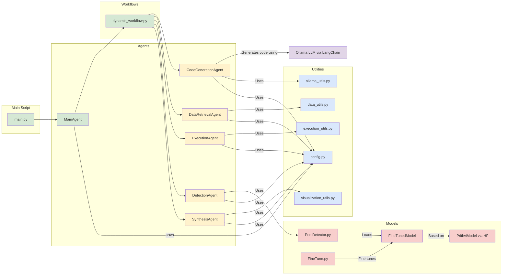
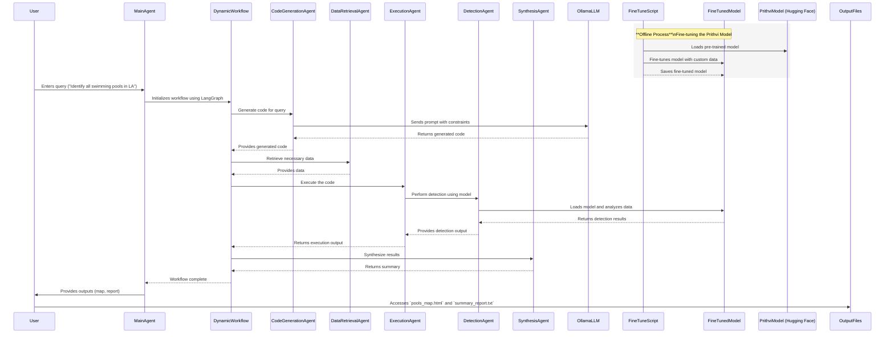

# Geospatial Analysis AI System

## Introduction

Welcome to the Geospatial Analysis AI System, a comprehensive solution for performing advanced geospatial analysis using artificial intelligence. This system leverages cutting-edge technologies to interpret natural language queries, generate executable code, execute it securely, and present results in an accessible format. The primary goal is to detect features such as swimming pools in satellite imagery using the Prithvi model from Hugging Face, which can be fine-tuned to improve performance on specific tasks.

## Key Technologies Used

- **LangChain**: Manages interactions with language models and builds agent workflows.
- **LangGraph**: Defines and executes dynamic workflows between agents.
- **Ollama**: Acts as the local LLM (Large Language Model) server for generating code based on user queries.
- **AI Agents**: Modular components that handle specific tasks in the workflow.
- **Prithvi Models**: Pre-trained geospatial models from Hugging Face, which can be fine-tuned for better accuracy.

## Table of Contents

1. [Architecture Overview](#architecture-overview)
2. [Detailed Components](#detailed-components)
3. [Execution Flow](#execution-flow)
4. [Agents and Multi-Agent System](#agents-and-multi-agent-system)
5. [Prithvi Models and Their Usage](#prithvi-models-and-their-usage)
6. [Sample Input and Response](#sample-input-and-response)
7. [Instructions for Reproduction](#instructions-for-reproduction)
8. [Conclusion](#conclusion)
9. [Acknowledgements and References](#acknowledgements-and-references)

## Architecture Overview

The system is composed of several key components, each responsible for specific functionalities. The following diagram illustrates the overall architecture and interactions between components:

The system is composed of several key components, each responsible for specific functionalities:

- **Main Script** (`main.py`): The entry point of the application.
- **Agents**: Individual modules that perform specific tasks.
  - Main Agent (`agents/main_agent.py`): Orchestrates other agents.
  - Code Generation Agent (`agents/code_generation_agent.py`): Generates Python code based on user queries.
  - Execution Agent (`agents/execution_agent.py`): Executes the generated code securely.
  - Synthesis Agent (`agents/synthesis_agent.py`): Processes execution output and summarizes results.
  - Data Retrieval Agent (`agents/data_retrieval_agent.py`): Fetches necessary geospatial data.
  - Detection Agent (`agents/detection_agent.py`): Handles object detection using models.
- **Models**: Contains code related to machine learning models.
  - Pool Detector (`models/pool_detector.py`): Implements pool detection using the Prithvi model.
  - Fine-tuning Script (`models/fine_tune.py`): For fine-tuning models with custom datasets.
- **Utilities** (`utils/`): Helper functions and configurations.
  - Configuration (`utils/config.py`): Stores configuration variables.
  - Execution Utilities (`utils/execution_utils.py`): Functions for code execution.
  - Visualization Utilities (`utils/visualization_utils.py`): Functions for visualizations.
  - Data Utilities (`utils/data_utils.py`): Functions for data handling.
  - Ollama Utilities (`utils/ollama_utils.py`): Functions to interact with Ollama.
- **Workflows**:
  - Dynamic Workflow (`workflows/dynamic_workflow.py`): Manages the sequence of agent executions using LangGraph.

## Detailed Components

### Main Script (main.py)

**Purpose**: Serves as the entry point of the application, initializing the main agent and starting the process.

**Functionality**:
- Accepts user queries.
- Initializes the MainAgent.
- Starts the execution workflow.

### Agents

#### Main Agent (agents/main_agent.py)

**Purpose**: Orchestrates the entire workflow using LangChain's agent framework and LangGraph.

**Functionality**:
- Initializes the LLM (Ollama) via LangChain.
- Defines tools (agents) using LangChain's Tool class.
- Uses dynamic_workflow.py to manage workflows using LangGraph.
- Coordinates the execution of other agents based on the workflow.

**Interactions**:
- Interacts with all other agents.
- Utilizes configurations from utils/config.py.

#### Code Generation Agent (agents/code_generation_agent.py)

**Purpose**: Generates Python code based on user queries using the LLM.

**Functionality**:
- Uses LangChain's PromptTemplate and Ollama's LLM interface.
- Renders a prompt with the user's query and specified constraints.
- Receives and returns the generated code.

**Interactions**:
- Called by MainAgent.
- Interacts with Ollama via utils/ollama_utils.py.

#### Execution Agent (agents/execution_agent.py)

**Purpose**: Executes the generated code in a secure environment.

**Functionality**:
- Uses execute_code from utils/execution_utils.py.
- Handles exceptions and errors during execution.
- Ensures safe execution through sandboxing.

**Interactions**:
- Receives code from CodeGenerationAgent.
- Returns execution output to MainAgent.

#### Synthesis Agent (agents/synthesis_agent.py)

**Purpose**: Processes the execution output and synthesizes the results.

**Functionality**:
- Extracts key information from execution output.
- Formats results for presentation (e.g., summaries, insights).

**Interactions**:
- Receives execution output from ExecutionAgent.
- Returns synthesized results to MainAgent.

#### Data Retrieval Agent (agents/data_retrieval_agent.py)

**Purpose**: Fetches necessary geospatial data for analysis.

**Functionality**:
- Retrieves satellite imagery or other geospatial data.
- Handles data preprocessing and storage.

**Interactions**:
- May interact with external APIs or data sources.
- Provides data to DetectionAgent and other agents.

#### Detection Agent (agents/detection_agent.py)

**Purpose**: Handles object detection tasks using machine learning models.

**Functionality**:
- Uses models like the fine-tuned Prithvi model to detect features.
- Processes images and returns detection results.

**Interactions**:
- Interacts with models/pool_detector.py.
- Works with data provided by DataRetrievalAgent.

### Models

#### Pool Detector (models/pool_detector.py)

**Purpose**: Implements pool detection using the Prithvi model from Hugging Face.

**Functionality**:
- Loads the pre-trained or fine-tuned Prithvi model securely.
- Performs inference to detect pools in images.
- Optimizes model configurations for efficient analysis.

**Interactions**:
- Used by DetectionAgent.
- May be invoked directly in the code generated by CodeGenerationAgent.

#### Fine-tuning Script (models/fine_tune.py)

**Purpose**: Fine-tunes the Prithvi model or other models to improve performance on specific tasks.

**Functionality**:
- Processes custom datasets for fine-tuning.
- Implements the fine-tuning process using frameworks like PyTorch.
- Saves the fine-tuned model for later use.

**Interactions**:
- Interacts with the pre-trained Prithvi model from Hugging Face.
- Generates updated models stored locally or uploaded back to Hugging Face.

### Utilities (utils/)

#### Configuration (utils/config.py)

**Purpose**: Stores configuration variables and settings.

**Variables**:
- OLLAMA_API_URL: URL for the Ollama LLM server.
- OLLAMA_MODEL_NAME: Name of the Ollama LLM model.
- PRITHVI_MODEL_NAME: Model name for the Prithvi model (e.g., 'ibm-nasa-geospatial/Prithvi-100M').
- Other environment-specific settings.

#### Execution Utilities (utils/execution_utils.py)

**Purpose**: Provides functions for secure code execution.

**Functionality**:
- execute_code: Executes code strings in a secure, sandboxed environment.
- Implements timeouts and resource limits.

**Security Considerations**:
- Prevents execution of malicious code.
- Restricts access to system resources.

#### Visualization Utilities (utils/visualization_utils.py)

**Purpose**: Contains functions for creating visual outputs like maps and charts.

**Functionality**:
- Generates interactive maps using libraries like folium.
- Creates charts and graphs for data analysis.
- Enhances visual presentation of results.

#### Data Utilities (utils/data_utils.py)

**Purpose**: Provides data handling and preprocessing functions.

**Functionality**:
- Loads and preprocesses geospatial data.
- Handles data formats like GeoJSON, shapefiles, etc.
- Performs coordinate transformations and spatial operations.

#### Ollama Utilities (utils/ollama_utils.py)

**Purpose**: Contains functions to interact with the Ollama LLM server.

**Functionality**:
- Sends prompts to Ollama and receives responses.
- Manages API communication with the Ollama server.

### Workflows

#### Dynamic Workflow (workflows/dynamic_workflow.py)

**Purpose**: Manages the sequence of agent executions using LangGraph.

**Functionality**:
- Defines nodes and edges representing agents and their interactions.
- Allows for dynamic and conditional execution paths based on runtime data.
- Integrates with agents for seamless operation.

**Interactions**:
- Interacts with all agents to coordinate their execution.
- Utilizes LangGraph for workflow management.

## Execution Flow

### Step-by-Step Process

The following sequence diagram illustrates the detailed execution flow of the system, including the offline model fine-tuning process and the runtime workflow:

1. **Model Fine-Tuning** (Offline Process):
   - Fine-tuning the Prithvi Model:
     - Use models/fine_tune.py to fine-tune the Prithvi model with custom datasets.
     - Adjusts the model to return the desired outputs for specific detection tasks.
     - Saves the fine-tuned model for use during analysis.

2. **User Query Input**:
   - The user provides a natural language query via main.py.
   - Example: "Identify all swimming pools in Los Angeles and provide a map and a summary report."

3. **Main Agent Initialization**:
   - MainAgent initializes the system and sets up the LLM (Ollama) via LangChain.
   - Uses dynamic_workflow.py to define the workflow using LangGraph.

4. **Workflow Execution via LangGraph**:
   - LangGraph defines the execution flow between agents based on the user's query.
   - Agents are executed in a sequence determined by the workflow.

5. **Code Generation**:
   - CodeGenerationAgent generates Python code tailored to the user's query.
   - Interacts with the LLM (Ollama) through LangChain and utils/ollama_utils.py.
   - The generated code specifies the use of the fine-tuned Prithvi model.

6. **Data Retrieval**:
   - DataRetrievalAgent fetches necessary geospatial data, such as satellite imagery.

7. **Code Execution**:
   - ExecutionAgent executes the generated code securely using utils/execution_utils.py.
   - Invokes the DetectionAgent if required.

8. **Detection Process**:
   - DetectionAgent uses the fine-tuned Prithvi model from models/pool_detector.py to detect features.
   - Processes images and returns detection results.

9. **Result Synthesis**:
   - SynthesisAgent processes the execution output.
   - Extracts key information and formats the results for presentation.

10. **Output Delivery**:
    - Final results are provided to the user.
    - Outputs include interactive maps and summary reports.
    - Results are saved to the output/ directory.

## Agents and Multi-Agent System

### Agents as Modular Components

- Each agent performs a specific task, promoting modularity and scalability.
- Agents can be developed, tested, and maintained independently.
- Encourages reusability and flexibility within the system.

### Agent Interactions

- MainAgent orchestrates the flow, coordinating other agents via LangGraph.
- LangChain and LangGraph manage the sequencing and execution of agents.
- Agents communicate and exchange data as defined by the workflow.

### Use of LangChain and LangGraph

- **LangChain**:
  - Provides tools for interacting with LLMs.
  - Defines agents and their capabilities using the Tool class.

- **LangGraph**:
  - Used in dynamic_workflow.py to define and execute dynamic workflows.
  - Manages complex execution paths and dependencies between agents.

## Prithvi Models and Their Usage

### Integration of Prithvi Models

- Prithvi Model Name: 'ibm-nasa-geospatial/Prithvi-100M'
- Used in models/pool_detector.py for detection tasks.
- Fine-tuned models are loaded and utilized by DetectionAgent.

### Handling Hugging Face Credentials

- **Authentication**:
  - Access tokens are read from environment variables (HUGGINGFACE_TOKEN).
  - Ensures secure and authorized access to models.
  - Avoids hardcoding sensitive credentials in the code.

### Fine-tuning and Additional Models

- **Fine-Tuning Process**:
  - Performed using models/fine_tune.py.
  - Custom datasets are used to fine-tune the Prithvi model.
  - Adjusts the model to improve accuracy on specific tasks.

- **Potential for Additional Models**:
  - System can be extended to include models for detecting other features (e.g., buildings, vegetation).
  - Enhances the range of geospatial analyses the system can perform.

## Sample Input and Response

### Example of a User Query

"Identify all swimming pools in Los Angeles and provide a map and a summary report."

### Processing Steps

1. **User Input**:
   - User enters the query via main.py.

2. **MainAgent Initialization**:
   - System initializes and defines the workflow using LangGraph.

3. **Code Generation**:
   - CodeGenerationAgent generates code to perform the requested analysis.
   - Code specifies loading the fine-tuned Prithvi model.

4. **Data Retrieval**:
   - DataRetrievalAgent fetches satellite imagery for Los Angeles.

5. **Code Execution**:
   - ExecutionAgent executes the generated code.
   - Code performs pool detection and generates outputs.

6. **Detection Process**:
   - DetectionAgent uses the fine-tuned model to detect swimming pools.

7. **Result Synthesis**:
   - SynthesisAgent processes results and prepares a summary.

8. **Output Delivery**:
   - Outputs are saved to output/pools_map.html and output/summary_report.txt.
   - User is informed where to access the outputs.

### Expected Outputs

- **Interactive Map** (output/pools_map.html):
  - Displays locations of detected swimming pools.
  - Interactive features allow zooming and exploration.

- **Summary Report** (output/summary_report.txt):
  - Contains the total number of pools detected.
  - Includes key observations and statistical data.

## Instructions for Reproduction

[TODO]

## Conclusion

[TODO]

## Acknowledgements and References

[TODO]
